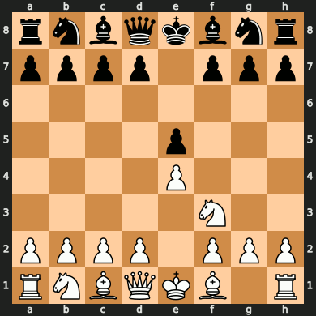

# LLM Chess Arena

## Now with visual Live Action Game

My contribution:

I came acros with this project and as a chess gamer and developer, could not check this out,
so, i run and love it and had some ideas to contribute with this project. hope you all like it.

- start adding a visual game play.
Now you can watch the models playing in graphical style! Just need a Image Viewer that reload
image when it changes, or move it from the each turns images. check the **screenshot_turn** function
made with help from cairosvg lib

- Change in board notation
I noticed that sometimes, the Model seems that was not "seeing" right the board. Trying to capture a piece that is not on that spot.
So, i remember that we have others notations, that is not so human readable, but maybe the model prefer that way, so why no test

- New Prompts
Sometimes, when AI Model is not responding very well, its not theyer fault, its our prompt fault.
With that in mind i tried to improve the gameplay with others prompts, one for a more aggressive play and
other with more stratigical play, suggesting traps, gambits, pins and others.

- Terminal chess board
I saw some lines of codes commented that was used to print the board on the termina.
Thats a good idea, lets give it some options? now you have 3 options for terminal board in 3 differents styles
SAN Notation, FEN Notation or ASCII style.

- How long was the match?
Start counting the matches time, this way we can know how long was that game
Also, included a sleep function so, depending on the model you are using, you will not
get high usabe not available message during the games. But keep in mind, it will delay the game
If you are a pro user, comment those sleep lines and get super fast games.

- The model can Quit!
During the tests, I noticed that sometime, even given the valid moves choices, the model
keep repeating the same output, so, i got that moves counter and give a use for it.
If counter is more than 5, indicate that the model dont know what to do, so "it decided" to quit the game

Others:
- print the current turn on the screen
- removed empty spaces from prompt (I beleive it counts as tokens)
- instead of passing prompt game history, now it get the current board in LEN
- the judge still input the history

Analysis:
- As the original project was analysim two different models, at this project i decided
to analyse how different prompts can lead model to different results, so I used the 
same model with different input prompts to see the result.

- With this modifications, i could get more interesting moves and mathces, but it still
seems two childens playing and discoverying how to play chess. But its was very fun anyway!

- increasing a litte bit the model temperature from 0.1 to 0.3 then to 0.5 seems not affect so much but i think we need more tests to get a better analysis result, you can play with the temperature and let me know what you think about it.

- move the game headers to before the game loop

|||
|-|-|
|||


# LLM Chess Arena


Este é o código fonte do projeto apresentado neste vídeo:
<br>
https://www.instagram.com/reel/C8Ndmh2OAze/

Este é um script que permite duas LLMs joguem Xadrez, nos permitindo (de maneira simplificada) comparar dois modelos de linguagem.
Adicionei um histórico de 20 partidas jogadas o ChatGPT-4o e Gemini-1.5 Pro.


## Como Rodar?

1. Clone o projeto.
2. Crie chaves de acesso para o ChatGPT e o Gemini.
3. Na pasta do projeto crie um arquivo chamado .env
4. Coloque suas API Key, no seguinte formato:

```
GOOGLE_API_KEY=sua-chave
OPENAI_API_KEY=sua-chave
```

5. Instale as dependências, abrindo seu terminal e usando o comando:

`pip install -r requirements.txt`

6. Execute o script `chess_arena_with_judge.py`


## PNG Live Action Game

7. Open game folder at ./playser vs player/game_1/
8. Open _live_game.png picture Viewer that reload image on change.


