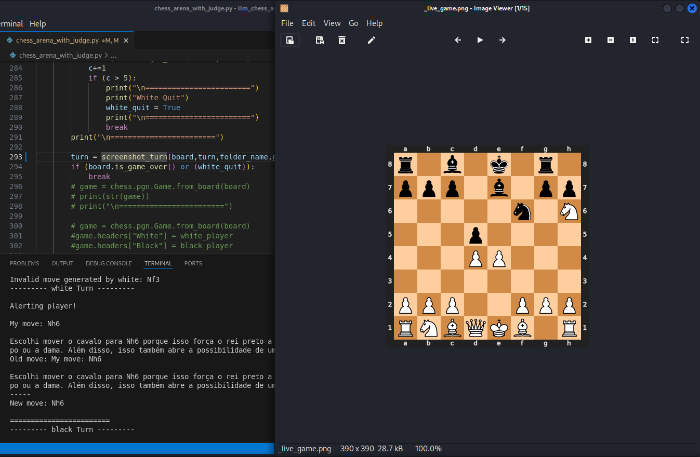

# LLM Chess Arena

## Now Featuring Visual Live Action Chess Games

### My Contribution:

As a chess enthusiast and developer, I stumbled upon this fantastic project and couldn't resist diving into it. After running it and enjoying the experience, I came up with a few ideas to enhance the project. I hope you find them helpful!

### Key Modifications:

- **Visual Gameplay:**
  I've added visual gameplay! You can now watch the models play chess in a graphical format. Simply use an image viewer that refreshes when the image changes, or manually navigate through the images for each turn. Check out the `screenshot_turn` function, which was implemented with the help of the `cairosvg` library.

- **Improved Board Notation:**
  I noticed that the model sometimes struggled to "see" the board correctly, occasionally attempting to capture pieces that weren't there. To address this, I introduced alternative board notations. Though less human-readable, they may suit the model better.

- **New Prompts:**
  When AI models don't perform well, it's often a prompt issue. I created new prompts to improve gameplay: one for aggressive play, and another focusing on strategic moves, including traps, gambits, and pins.

- **Terminal Chess Board Options:**
  The code already had a commented-out feature for printing the board in the terminal, which I found intriguing. Now, there are three options for displaying the board in the terminal: SAN notation, FEN notation, or an ASCII-style board. Or just disable it using opt_print_board = False.

- **Match Duration:**
  Matches are now timed, allowing you to see how long each game lasts. A sleep function was also added to prevent high usage issues with certain models, though it will slow down gameplay. If you're a PRO user, feel free to comment out the sleep lines for faster games.

- **Model Resignation:**
  During testing, I noticed that when models repeat the same output despite valid moves, they are likely stuck. I used the move counter, and if a model repeats the same output for more than five moves, it "decides" to quit.

### Additional Features:

- Displays the current turn on the screen.
- Removed unnecessary spaces in the prompt to optimize token usage.
- Now passes the current board state in LEN instead of the entire game history in the prompt.
- The judge still inputs the game history when model do invalid moves.

### Analysis:

- Instead of comparing two models, as the original project did, my version analyzes how different prompts affect the same model. Using identical models with various prompts allowed me to observe different outcomes.
  
- These modifications resulted in more interesting and diverse moves, though the games sometimes still feel like two children learning to play chess. Nonetheless, it was great fun!
  
- Increasing the model's temperature slightly (from 0.1 to 0.3 and then 0.5) didn't have a significant effect, but more testing is needed. Feel free to experiment with the temperature settings and share your results.

- I also moved the game headers to appear before the game loop for a cleaner structure.

---

## Visual Examples:

|||
|-|-|
|||

---

## Setup Instructions:

### Before You Start:

1. **Create a Virtual Environment:**
   ```
   python -m venv .venv
   ```

2. Create API keys for ChatGPT and Gemini.

### Lets Build:

3. Clone the project:
   ```bash
   git clone https://github.com/your-repo/llm-chess-arena.git
   cd llm-chess-arena
   ```

4. Install dependencies:
   ```bash
   pip install -r requirements.txt
   ```

5. If you prefer using a `.env` file in the project directory:
   ```
   GOOGLE_API_KEY=your-google-api-key
   OPENAI_API_KEY=your-openai-api-key
   ```
OR

**Export Your API Keys:**
   You'll need to set up your API keys for ChatGPT and Gemini by exporting them as environment variables:
   
   ```bash
   export GOOGLE_API_KEY="your-api-key"
   export OPENAI_API_KEY="your-api-key"
   export GROQ_API_KEY="your-api-key"
   export BASE_URL="https://api.groq.com"
   ```

6. Run the chess arena script:
   ```bash
   python chess_arena_with_judge.py
   ```

---

## PNG Live Action Game:

7. Open the game folder at `./model_vs_model/game_1/`.
8. Use an image viewer to open `./model_vs_model/_live_game.png`. Ensure your viewer auto-refreshes the image when it changes.
9. Navigate output files and find out more about the game match.
10. Most important! Have Fun!!!

---

## Credits:

This project is based on the original LLM Chess Arena, which allows two language models to play chess and compare their performance. Special thanks to the original creators for their fantastic work. You can find more details and watch the original video here:

- [Instagram Video](https://www.instagram.com/reel/C8Ndmh2OAze/)

---

Feel free to share feedback, suggestions, or improvements!
